# Phase 4 Architecture Diagrams

Visual representations of the LLM-powered content generation system.

---

## System Architecture

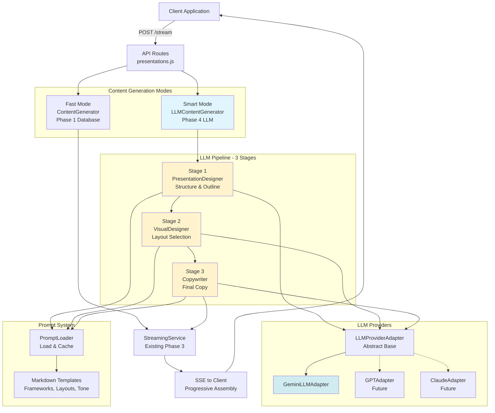

---

## Data Flow Diagram

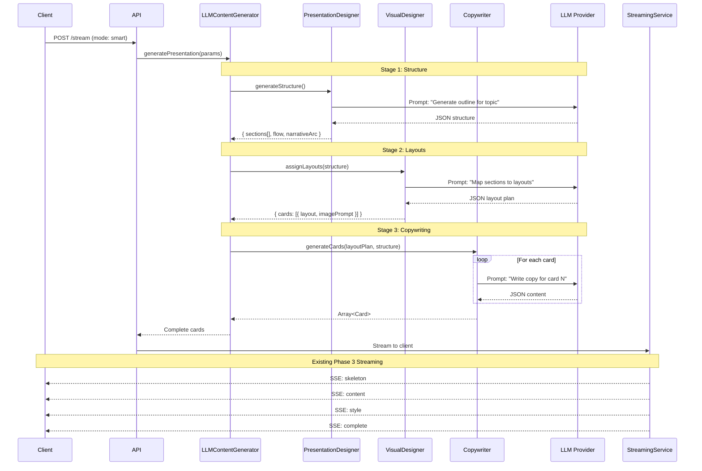

---

## Service Dependencies

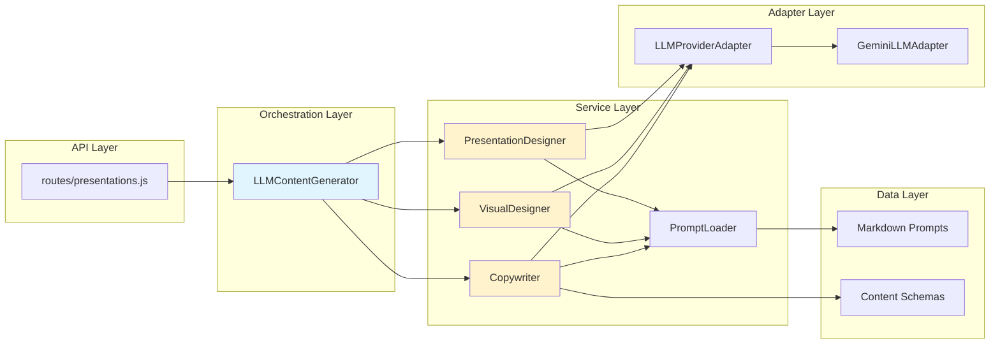

---

## 3-Stage Pipeline Detail

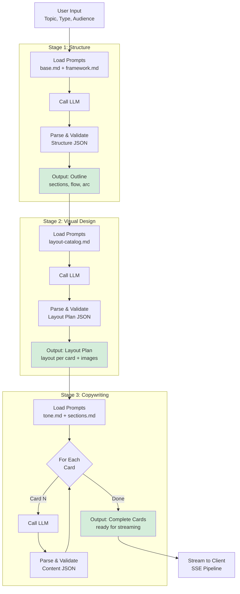

---

## Prompt Template System

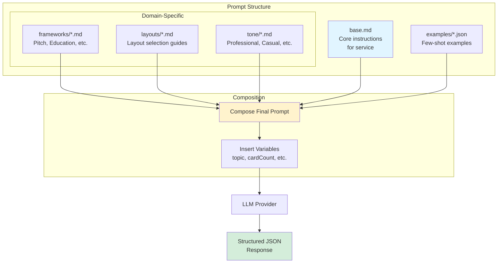

---

## Error Handling Flow

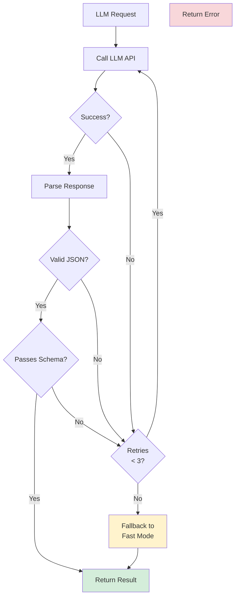

---

## Deployment Architecture

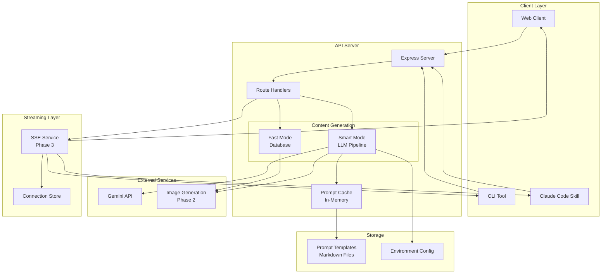

---

## Request Flow Timeline

```mermaid
gantt
    title Smart Mode Request Timeline (6-card presentation)
    dateFormat X
    axisFormat %Ss

    section API
    Receive Request           :0, 100ms
    Route to Smart Mode       :100ms, 50ms

    section Stage 1
    Load Prompts             :150ms, 200ms
    Call LLM (Structure)     :350ms, 3s
    Parse Structure          :3350ms, 150ms

    section Stage 2
    Load Layout Prompts      :3500ms, 100ms
    Call LLM (Layouts)       :3600ms, 2s
    Parse Layouts            :5600ms, 100ms

    section Stage 3
    Load Copy Prompts        :5700ms, 100ms
    Generate Card 1          :5800ms, 2s
    Generate Card 2          :7800ms, 2s
    Generate Card 3          :9800ms, 2s
    Generate Card 4          :11800ms, 2s
    Generate Card 5          :13800ms, 2s
    Generate Card 6          :15800ms, 2s

    section Streaming
    Start SSE Stream         :17800ms, 100ms
    Send Skeleton            :17900ms, 100ms
    Send Content             :18000ms, 500ms
    Send Styles              :18500ms, 200ms
    Complete                 :18700ms, 100ms
```

---

## Comparison: Fast vs Smart Mode

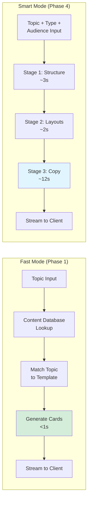

---

## Technology Stack

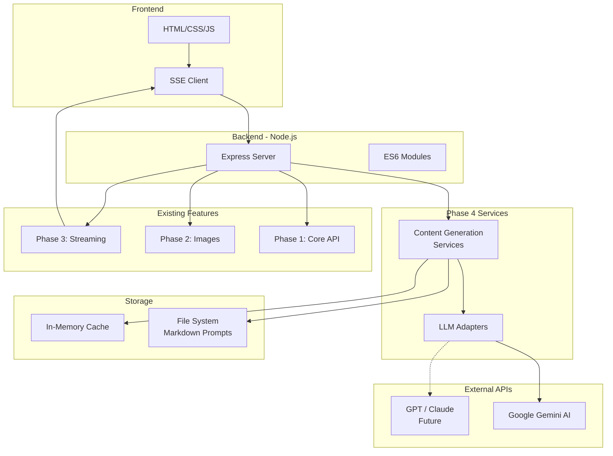

---

## Key Architectural Patterns

### 1. Strategy Pattern (LLM Providers)
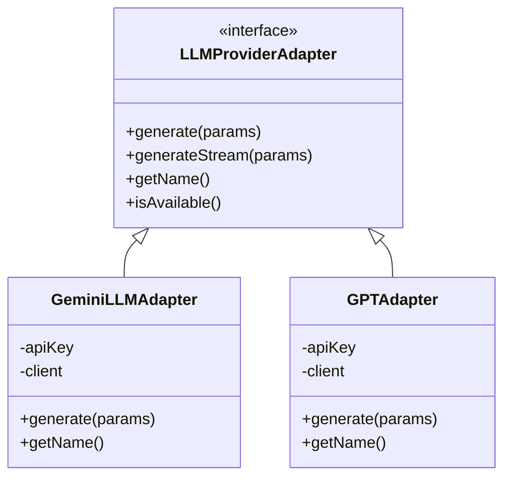

### 2. Pipeline Pattern (3 Stages)
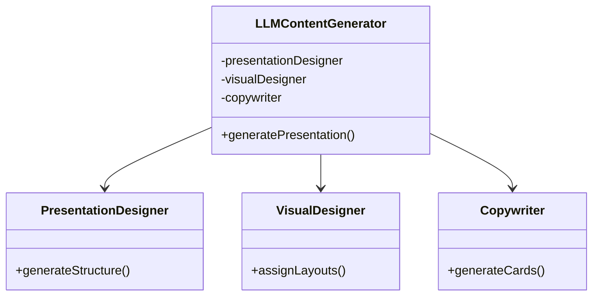

### 3. Template Method Pattern (Prompts)
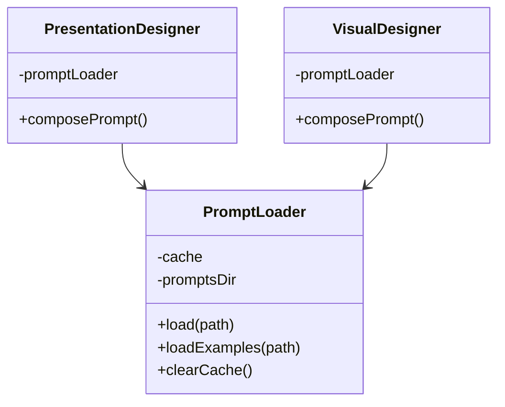

---

## Cost Analysis

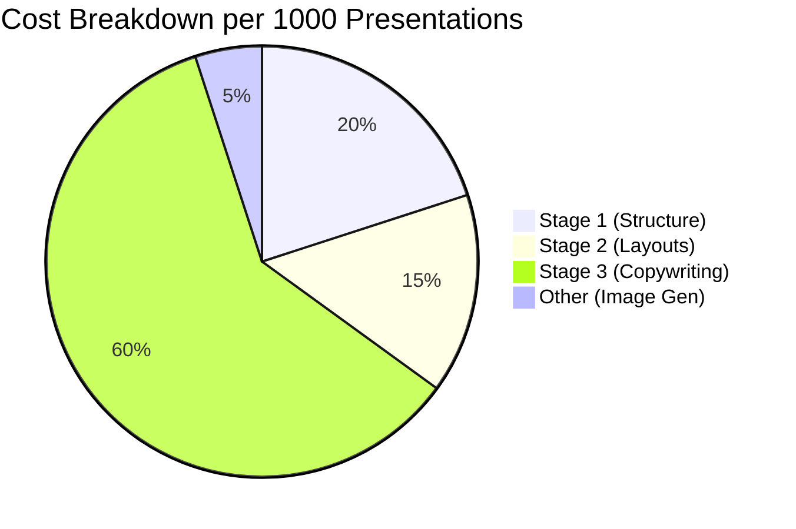

**Total Cost**: ~$1.00 per 1000 presentations with Gemini Flash

---

## Performance Optimization Strategies

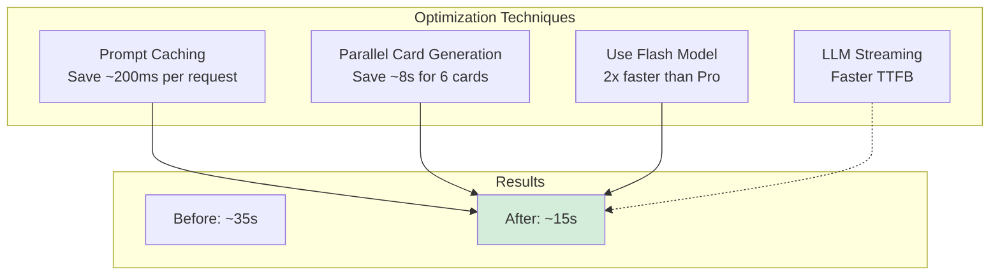

---

These diagrams provide visual representation of the Phase 4 architecture from multiple perspectives:

1. **System Architecture**: High-level component relationships
2. **Data Flow**: Step-by-step request processing
3. **Service Dependencies**: How services interact
4. **3-Stage Pipeline**: Detailed pipeline breakdown
5. **Prompt System**: Template composition
6. **Error Handling**: Resilience strategies
7. **Deployment**: Production architecture
8. **Timeline**: Performance characteristics
9. **Comparison**: Fast vs Smart modes
10. **Tech Stack**: Technologies used
11. **Patterns**: Design patterns applied
12. **Cost/Performance**: Optimization strategies

Use these diagrams in documentation, presentations, and architecture discussions!
